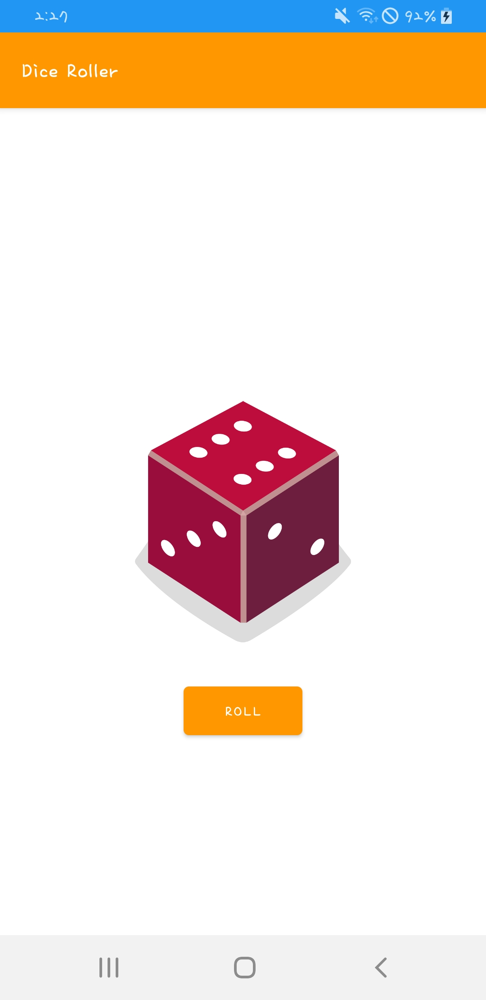
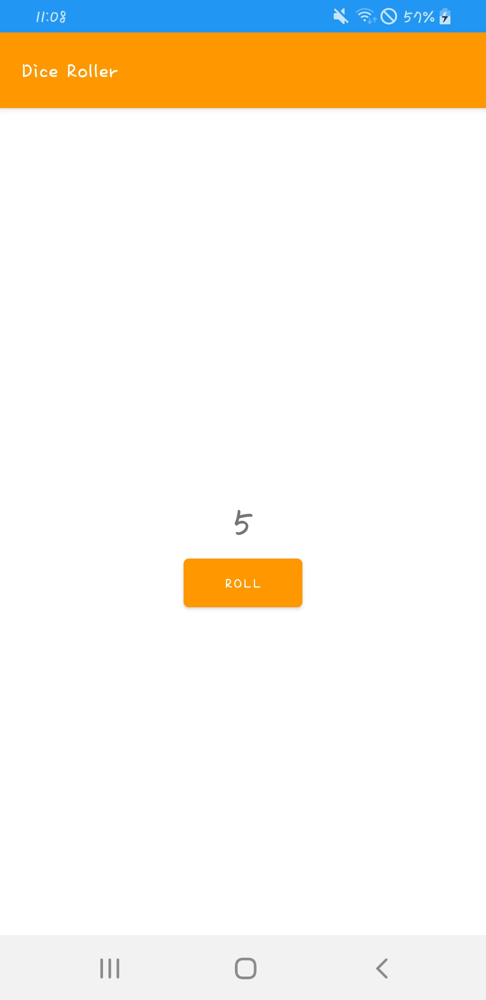
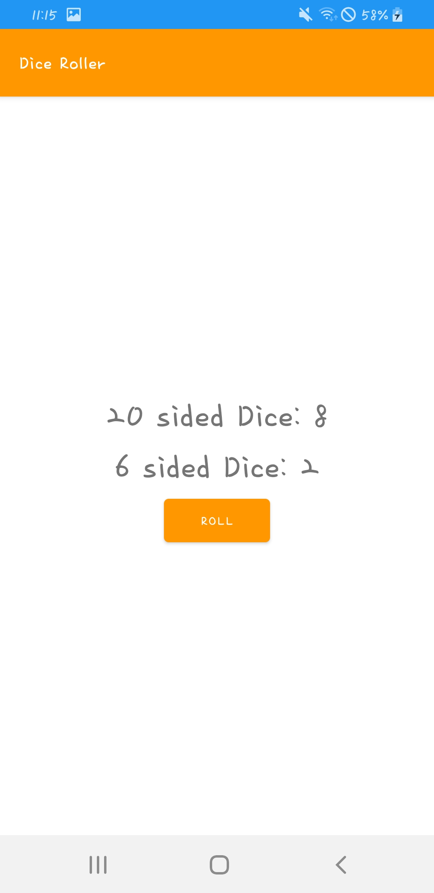
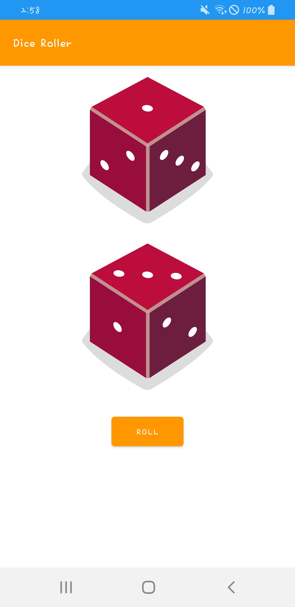

## [Unit 1 pathway 4] Dice Roller app


<center></center>

중앙의 Roll 버튼을 누를 때마다 중앙의 주사위 이미지가 랜덤한 숫자의 이미지로 변경된다.


### Kotlin의 클래스 및 객체 인스턴스

✏ **랜덤 숫자 random()**

`IntRange`는 데이터 유형의 하나로, 시작점부터 끝점까지 정수의 범위를 나타낸다.

```kotlin
fun main() {
    val diceRange = 1..6
    val randomNumber = diceRange.random()
    println("random number: ${randomNumber}")
}
```

이 코드로 1부터 6 사이의 랜덤 정수를 출력할 수 있다.

`val diceRange = 1..6` 여기서 자료형을 지정해주지 않았지만 시스템은 알아서 `val diceRange: IntRange = 1..6` 라고 해석한다.

( 변수형을 처음부터 지정하는 Java에 익숙한 나한테는 신기... 🤔 )

```kotlin
fun main() {
    val randomNumber = (1..6).random()
    println("random number: ${randomNumber}")
}
```

`(1..6).random()` 로 작성해도 결과는 똑같다.

✏ **Dice 클래스 만들기**

Kotlin에서는 주사위에 면이 있고 랜덤 숫자를 굴릴 수 있다고 표시하는 프로그래매틱 방식의 주사위 청사진을 만들 수 있다. 이 청사진을 `클래스`라고 한다.

`클래스`는 건축가의 청사진 도면. 즉 주택을 짓는 방법에 관한 안내도이고, 주택은 청사진에 따라 만들어진 실제 사물 또는 `객체 인스턴스` 다.

주사위에 관한 모든 내용을 클래스로 구성하는 작업을 `캡슐화`라고 한다. 논리적으로 관련된 기능을 단일 위치로 묶을 수 있다는 의미!

```kotlin
fun main() {
    val myFirstDice = Dice()
    myFirstDice.roll()
}
class Dice{
    var sides = 6
    fun roll(){
        val randomNumber = (1..6).random()
     	  println(randomNumber)
    }
}
```

Kotlin에서는 `class` 키워드로 새 클래스를 만든다.

클래스의 이름은 `파스칼 표기법`으로 작성한다. 예: `CustomerRecord` `ParkingMeter`

Dice 클래스 내부에는 주사위 개념에 대한 청사진이 담겨있다. 실제 주사위를 만드려면 이 청사진을 이용해 Dice `객체 인스턴스`를 생성해야 한다.

`val myFirstDice = Dice()` 이 처럼 Dice 객체를 생성할 수 있다.

클래스 내에는 주사위를 굴리는 함수가 있다. 클래스 내에서 정의된 함수는 `메서드`라고 한다.

이제 출력은 main에서, 함수는 값을 반환하도록 수정하자.

```kotlin
fun main() {
    val myFirstDice = Dice()
    val diceRoll = myFirstDice.roll()
    println("${myFirstDice.sides} sided dice")
    println("Dice result: ${diceRoll}")
}
class Dice{
    var sides = 6
    fun roll(): Int{
        val randomNumber = (1..6).random()
	     	return randomNumber
    }
}
// 출력 결과
// 6 sided dice
// Dice result: 3
```

`val diceRoll = myFirstDice.roll()` 함수가 반환한 값을 받을 `diceRoll` 변수를 선언하고, `roll()` 함수에 반환할 데이터 유형을 지정하고, `return` 문을 작성한다.

✏ **주사위의 면 수 변경하기**

```kotlin
fun main() {
    val myFirstDice = Dice()
    val diceRoll = myFirstDice.roll()
    println("${myFirstDice.sides} sided dice")
    println("Dice result: ${diceRoll}")
    myFirstDice.sides = 20
    println("${myFirstDice.sides} sided dice")
    println("Dice result: ${myFirstDice.roll()}")
}
class Dice{
    var sides = 6
    fun roll(): Int{
        val randomNumber = (1..sides).random()
	     	return randomNumber
    }
}
/* 출력 결과
6 sided dice
Dice result: 2
20 sided dice
Dice result: 11
*/
```

roll() 함수의 randomNumber 생성 부분을 1~6이 아닌 1~sides로 변경하고, main에서 `myFirstDice.sides = 20` 로 주사위의 면 수를 변경한다.

`println("Dice result: ${myFirstDice.roll()}")` 그 다음 프린트문에서 다시 roll()을 실행시켜 새로운 값을 받아와 출력한다.

❗ var 와 val 여기서 sides는 var로 선언되어 있기 때문에 변경 가능하다. val로 선언된 변수는 값을 변경할 수 없다.

✏ **주사위 클래스 수정하기**

실제 주사위는 면의 수를 변경할 수 없다. 면 수는 구매할 때 결정하는 것이기 때문에 객체 생성시 정하고 그 뒤로는 변경할 수 없는 게 맞다.

```kotlin
fun main() {
    val myFirstDice = Dice(6)
    println("${myFirstDice.numSides} sided dice\\nDice result: ${myFirstDice.roll()}")
    val mySecondDice = Dice(20)
    println("${mySecondDice.numSides} sided dice\\nDice result: ${mySecondDice.roll()}")
}
class Dice(val numSides: Int){
    fun roll(): Int{
	    return (1..numSides).random()
    }
}
/*
6 sided dice
Dice result: 1
20 sided dice
Dice result: 11
*/
```

`class Dice(val numSides: Int)` Dice 클래스를 수정하여 생성 시 `numSides` 변수에 값을 넣도록 한다.

이 변수는 수정할 수 없기 때문에 main의 코드도 수정해야 한다. `myFirstDice`의 면을 수정하는 것이 아니라 면이 20개인 Dice 객체를 `mySecondDice`라는 이름으로 새롭게 생성한다.

`리팩토링` 과정을 통해 코드도 간결하게 수정했다. roll()의 결과값을 담을 변수를 선언하지 않고, 바로 출력하고, roll() 메소드 내부에서도 값을 바로 리턴하도록 한다.

✏ **연습하기 1 주사위에 색성 속성 추가하기**

```kotlin
fun main() {
    val myFirstDice = Dice(6, "Red")
    println("${myFirstDice.numSides} sided ${myFirstDice.color} dice\\nResult: ${myFirstDice.roll()}")
    val mySecondDice = Dice(10, "Blue")
    println("${mySecondDice.numSides} sided ${mySecondDice.color} dice\\nResult: ${mySecondDice.roll()}")
    val myThirdDice = Dice(20, "Green")
    println("${myThirdDice.numSides} sided ${myThirdDice.color} dice\\nResult: ${myThirdDice.roll()}")
}
class Dice(val numSides: Int, val color: String){
    fun roll(): Int{
	    return (1..numSides).random()
    }
}
/*
6 sided Red dice
Result: 1
10 sided Blue dice
Result: 4
20 sided Green dice
Result: 14
*/
```

✏ **연습하기 2 Coin 뒤집기**

```kotlin
fun main(){
    val myFirstCoin = Coin()
    println("Result: ${myFirstCoin.flip()}")
}
class Coin(){
    fun flip(): String{
        if((0..1).random()==0){
            return "Head"
        }
        else{
            return "Tail"
        }
    }
}
// Result: Tail
```

❗ 코틀린에는 삼항연산자가 없다...

대신 `if((0..1).random()==0) return "Head" else return "Tail"` 이렇게 사용할 수 있다.

```kotlin
fun main(){
    val myFirstCoin = Coin()
    println("Result: ${myFirstCoin.flip()}")
}
class Coin(){
    fun flip(): String{
        if((0..1).random()==0) return "Head" else return "Tail"
    }
}
```

### Dice Roller 앱 만들기

✏ **Activity**

Activity는 앱이 UI를 그리는 창을 제공한다. 일반적으로 Activity는 실행되는 앱의 전체 화면을 차지한다. 모든 앱에는 하나 이상의 activity가 존재한다.

✏ **MainActivity.kt 살펴보기**

```kotlin
class MainActivity : AppCompatActivity() {
    override fun onCreate(savedInstanceState: Bundle?) {
        super.onCreate(savedInstanceState)
        setContentView(R.layout.activity_main)
    }
}
```

기본적으로 빈 프로젝트를 생성했을 때 작성되어 있는 코드다.

`MainActivity`에는 `main()` 함수가 없다. Android 앱은 `main()` 함수를 호출하는 대신 앱이 처음 열릴 때 `MainActivity`의 `onCreate()` 메서드를 호출한다.

`setContentView()`로 시작 레이아웃을 `MainActivity` 로 설정한다.

✏ **Toast 메시지**

```kotlin
val toast = Toast.makeText(this, "Dice Rolled!", Toast.LENGTH_SHORT)
toast.show()
// 또는 
Toast.makeText(this, "Dice Rolled!", Toast.LENGTH_SHORT).show(
```

✏ **1차로 완성된 코드**

```kotlin
class MainActivity : AppCompatActivity() {
    override fun onCreate(savedInstanceState: Bundle?) {
        super.onCreate(savedInstanceState)
        setContentView(R.layout.activity_main)
        val rollButton: Button = findViewById(R.id.button)
        rollButton.setOnClickListener{
            rollDice()
        }
    }
    private fun rollDice() {
        val dice = Dice(6)
        val diceRoll = dice.roll()
        val resultTV: TextView = findViewById(R.id.textView)
        resultTV.text = diceRoll.toString()
    }
}
class Dice(val numSides: Int){
    fun roll(): Int{
        return (1..numSides).random()
    }
}
```

어플을 실행하면 버튼을 누를 때마다 랜덤한 주사위의 숫자가 랜덤하게 나오는 것을 확인할 수 있다.

<center></center>

✏ **이제 코드를 정리해보자**

코드를 전부 선택(ctrl+A)하고 `Code > Reformat Code` 또는 `ctrl+alt+L` 하면 공백이나 간격 등이 형식에 알맞게 수정된다.

코드에 대한 주석도 추가한다.

```kotlin
/**
 * 이 액티비티는 사용자가 주사위를 굴려 그 결과를 화면에 볼 수 있도록 한다.
 */
class MainActivity : AppCompatActivity() {
    override fun onCreate(savedInstanceState: Bundle?) {
        super.onCreate(savedInstanceState)
        setContentView(R.layout.activity_main)
        val rollButton: Button = findViewById(R.id.button)
        rollButton.setOnClickListener { rollDice() }
    }

    /**
     * 주사위를 굴리고 그 결과를 화면에 업데이트한다.
     */
    private fun rollDice() {
        // 6면 주사위를 생성한다.
        val dice = Dice(6)
        val diceRoll = dice.roll()
        // 화면에 주사위 결과를 업데이트한다.
        val resultTV: TextView = findViewById(R.id.textView)
        resultTV.text = diceRoll.toString()
    }
}

class Dice(val numSides: Int) {
    fun roll(): Int {
        return (1..numSides).random()
    }
}
```

✏ **연습하기 - 주사위 2개 굴리기**

```kotlin
/**
 * 이 액티비티는 사용자가 주사위를 굴려 그 결과를 화면에 볼 수 있도록 한다.
 */
class MainActivity : AppCompatActivity() {
    override fun onCreate(savedInstanceState: Bundle?) {
        super.onCreate(savedInstanceState)
        setContentView(R.layout.activity_main)
        val rollButton: Button = findViewById(R.id.button)
        rollButton.setOnClickListener { rollDice() }
    }

    /**
     * 주사위를 굴리고 그 결과를 화면에 업데이트한다.
     */
    @SuppressLint("SetTextI18n")
    private fun rollDice() {
        // 6면 주사위를 생성한다.
        val dice = Dice(6)
        val diceRoll = dice.roll()
        val dice2 = Dice(20)
        // 화면에 주사위 결과를 업데이트한다.
        val resultTV: TextView = findViewById(R.id.textView)
        resultTV.text = "${dice.numSides} sided Dice: "+diceRoll.toString()
        val resultTV2: TextView = findViewById(R.id.textView2)
        resultTV2.text = "${dice2.numSides} sided Dice: "+dice2.roll().toString()
    }
}

class Dice(val numSides: Int) {
    fun roll(): Int {
        return (1..numSides).random()
    }
}
```

`@SuppressLint("SetTextI18n")` 이게 뭔지는 잘 모르겠다🤔 없어도 실행은 잘 되는데 안드로이드 스튜디오가 추가하래서 추가했다😅 [Stackoverflow 참고](https://stackoverflow.com/questions/62245794/why-do-we-need-to-add-suppresslintsettexti18n-annotation-before-concatenati) 하드코딩과 관련된 것 같다! 예를들어 돈을 표현할 때 나라마다 단위가 다른데 코드를 수정하지 않아도 알아서 바뀌도록?

<center></center>

### 조건부 동작 익히기

**✏ if**

if else 조건문은 다른 언어와 거의 똑같기 때문에 실습한 코드만 첨부한다.

```kotlin
fun main() {
    val myFirstDice = Dice(6)
    val rollResult = myFirstDice.roll()
    val luckyNumber = 4
    if(rollResult==luckyNumber){
        println("You win:)")
    }else if(rollResult==1){
        println("You lose:( You rolled a 1. Try again!")
    }else if(rollResult==2){
        println("You lose:( You rolled a 2. Try again!")
    }else if(rollResult==3){
        println("You lose:( You rolled a 3. Try again!")
    }else if(rollResult==5){
        println("You lose:( You rolled a 5. Try again!")
    }else{
        println("You lose:( You rolled a 6. Try again!")
    }
}
class Dice (val numSides: Int) {
    fun roll(): Int {
        return (1..numSides).random()
    }
}
```

**✏ When 문 사용하기**

when 문은 자바나 c++에서 사용했던 `switch`문과 유사하다. `when()`안에 있는 `rollResult`의 값이 어느 것에 해당하냐에 따라 실행할 코드를 작성할 수 있다.

```kotlin
fun main() {
    val myFirstDice = Dice(6)
    val rollResult = myFirstDice.roll()
    val luckyNumber = 4
    when(rollResult){
        luckyNumber -> println("You win:)")
        1 -> println("You lose:( You rolled a 1. Try again!")
        2 -> println("You lose:( You rolled a 2. Try again!")
        3 -> println("You lose:( You rolled a 3. Try again!")
        5 -> println("You lose:( You rolled a 5. Try again!")
        6 -> println("You lose:( You rolled a 6. Try again!")
    }
}
class Dice (val numSides: Int) {
    fun roll(): Int {
        return (1..numSides).random()
    }
}
```

- 🔗 [Kotlin의 Conditions and loops 더 자세히 알아보기](https://kotlinlang.org/docs/control-flow.html)

  **when**

  ```kotlin
  // else
  when (x) {
      0, 1 -> print("x == 0 or x == 1")
      else -> print("otherwise")
  }
  
  // 범위내에 존재 유무
  when (x) {
      in 1..10 -> print("x is in the range")
      in validNumbers -> print("x is valid")
      !in 10..20 -> print("x is outside the range")
      else -> print("none of the above")
  }
  ```

### Dice Roller 앱에 주사위 이미지 추가하기

기존 `TextView`를 없애고, 주사위 이미지를 담을 `ImageView`를 추가했다. 6개의 주사위 이미지를 `drawable`에 담고, `MainActivity.kt` 코드를 수정한다.

```kotlin
private fun rollDice() {
        // 6면 주사위를 생성한다.
        val dice = Dice(6)
        val diceRoll = dice.roll()
        val diceImage: ImageView = findViewById(R.id.imageView)
        when(diceRoll){
            1 -> diceImage.setImageResource(R.drawable.dice_1)
            2 -> diceImage.setImageResource(R.drawable.dice_2)
            3 -> diceImage.setImageResource(R.drawable.dice_3)
            4 -> diceImage.setImageResource(R.drawable.dice_4)
            5 -> diceImage.setImageResource(R.drawable.dice_5)
            6 -> diceImage.setImageResource(R.drawable.dice_6)
        }
}
```

`rollDice()` 함수의 코드를 작성하면 다음과 같이 주사위 앱이 완성된다.

<center></center>

```kotlin
val drawableResource = when(diceRoll){
            1 -> R.drawable.dice_1
            2 -> R.drawable.dice_2
            3 -> R.drawable.dice_3
            4 -> R.drawable.dice_4
            5 -> R.drawable.dice_5
            else -> R.drawable.dice_6
        }
diceImage.setImageResource(drawableResource)
```

마지막으로 주석을 추가하고, `contentDescription`을 작성한다.

```kotlin
		/**
     * 주사위를 굴리고 그 결과를 화면에 업데이트한다.
     */
    private fun rollDice() {
        // 6면 주사위를 생성하고 주사위를 굴린다
        val dice = Dice(6)
        val diceRoll = dice.roll()
        // imageView 를 찾는다
        val diceImage: ImageView = findViewById(R.id.imageView)
        // 주사위를 굴린 결과에 해당하는 drawable resource 를 찾는다
        val drawableResource = when(diceRoll){
            1 -> R.drawable.dice_1
            2 -> R.drawable.dice_2
            3 -> R.drawable.dice_3
            4 -> R.drawable.dice_4
            5 -> R.drawable.dice_5
            else -> R.drawable.dice_6
        }
        // Update ImageView
        diceImage.setImageResource(drawableResource)
        // Update content description
        diceImage.contentDescription = diceRoll.toString()
    }
```


**✏ 연습하기 - 주사위 2개 굴리기**

<center></center>

