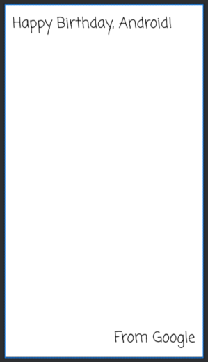

## [Unit1 pathway 3] Build a basic layout

**최종 화면**


아주 심플한 어플이지만 코틀린이 처음이고, 안드로이드 스터디에 들어간 이상 기초부터 끝까지 완료하는 것을 목표로 실습도 꼼꼼히 하려고 한다!


**Qualities of a great app**

- Effective
- Efficient
- Beautiful
- Accessible

**사용자 인터페이스 UI**

UI를 통해 앱은 사용자에게 콘텐츠를 표시하고 사용자는 앱과 상호작용한다.

앱의 UI는 화면에 표시되는 텍스트, 이미지, 버튼 등 여러 유형의 요소이다.

이러한 각 요소를 `View`라고 한다.

`ViewGroup`은 `View`객체가 있을 수 있는 컨테이너로, 내부 `View`들을 정렬하는 역할을 한다.

`ViewGroup` 중 `ConstraintLayout`이 있다.

✏ 기존 `TextView`의 Hello World 텍스트를 변경해보자.

✏ `ConstraintLayout`에 `TextView`를 배치하고 내용을 작성해보자.

✏ 텍스트에 스타일 추가해보자.



> **참고**: UI의 여백 및 기타 거리 단위는 밀도 독립형 픽셀(dp)입니다. 센티미터나 인치와 비슷하지만 화면상의 거리를 나타냅니다. Android에서는 이 값을 각 기기의 적절한 실제 픽셀 수로 변환합니다. 기준으로 1dp는 1인치의 약 160분의 1이지만 기기에 따라 더 크거나 작을 수 있습니다.

> **참고**: dp가 화면상의 거리 측정 단위인 것처럼 sp는 글꼴 크기 측정 단위입니다. Android 앱의 UI 요소는 두 가지 측정 단위를 사용합니다. 하나는 밀도 독립형 픽셀(dp)로, 이전에 레이아웃에서 사용했고 또 하나는 확장 가능한 픽셀(sp)로, 텍스트 크기를 설정할 때 사용합니다. `기본적으로 sp는 dp와 같은 크기이지만 sp는 사용자가 선호하는 텍스트 크기에 따라 크기가 조절됩니다`.

- 추가적인 참고 내용

  🔗 [다양한 픽셀 밀도 지원](https://developer.android.com/training/multiscreen/screendensities) 

  픽셀로 크기를 정의하면 화면 크기에 따라 픽셀 밀도가 달라져 기기에 따라 실제 크기가 달라질 수 있다.

  밀도가 서로 다른 화면에서 UI 표시 크기를 유지하려면 `밀도 독립형 픽셀(dp)`을 측정 단위로 사용해서 UI를 디자인해야한다.

  Android는 dp 값을 밀도마다 적합한 실제 픽셀 수로 변환한다. `px = dp * (dpi / 160)`

  그러나 텍스트 크기를 정의할 때는 확장 가능 픽셀(sp)을 단위로 사용해야 한다.(단, 레이아웃 크기에는 sp를 사용하지 않아야 함). sp 단위는 기본적으로 dp와 같은 크기이지만, 사용자가 선호하는 텍스트 크기에 따라 크기가 조절됩니다.

  **대체 비트맵 제공**

  픽셀 밀도가 서로 다른 기기에서 좋은 그래픽 품질을 제공하기 위해서는 앱에 있는 각 비트맵에 관해 밀도 버킷마다 해당하는 해상도로 여러 개의 비트맵 버전을 제공한다.

  밀도 한정자 `mdpi` `hdpi` `xhdpi` 등등 에 따라 다른 비트맵 버전 제공.

  생성된 이미지 파일을 `res/`의 적절한 하위 디렉터리에 배치하면 시스템에서 앱이 실행되는 기기의 픽셀 밀도에 따라 자동으로 알맞은 크기를 선택한다.

  ```
  res/
  	drawable-xxxhdpi/
  		awesome-image.png
  	drawable-xxhdpi/
  		awesome-image.png
  	. . .
  ```

  이렇게 해두면 `@drawable/awesomeimage` 참조시 적절한 비트맵 선택

  **앱 아이콘은 mipmap**

  일부 앱 런처는 기기의 밀도 버킷에서 요구하는 것보다 최대 25% 더 크게 아이콘을 표시한다. 즉 아이콘이 선명하지 않게 표시된다.

  앱 아이콘이 확장될 수 있기 때문에 모든 앱 아이콘을 `drawable` 디렉터리가 아닌 `mipmap` 디렉터리에 넣어야 한다. 밀도별 APK를 빌드하더라도 drawable 디렉터리와 달리, 모든 mipmap 디렉터리는 APK에 유지되기 때문!

  **벡터 그래픽 사용하기**

  벡터 그래픽은 크기를 확장해도 깨지지 않으니까 이걸 쓰는 것도 하나의 방법


✏ ImageView 추가하기

Android 스튜디오의 Resource Manager를 사용해 이미지와 기타 리소스를 추가하고 구성할 수 있다.

1. 사용할 이미지를 `drawable`에 넣고, `ImageView`를 화면에 배치해 이미지를 화면에 올릴 수 있다.

2. `ConstraintLayout`의 가로세로 제약조건을 추가한다.

3. 전체 화면에 채우기 위해서는 `ScaleType`을 설정해야 한다. 여기서는 `CENTER_CROP`으로 설정한다. `CENTER_CROP` 으로 설정하면 이미지가 비율을 유지하면서 늘어나 화면에 꽉 차게 된다. (실제 이미지는 화면을 넘어간 크기)

   - ScaleType 참고 내용

     🔗 [ImageView.ScaleType 문서](https://developer.android.com/reference/kotlin/android/widget/ImageView.ScaleType)

     `CENTER` : center에 배치할뿐 scaling은 없다.

     `CENTER_CROP` : 비율을 유지하며 scale 한다. 이미지의 크기는 view보다 크거나 같다.

     `CENTER_INSIDE` : 비율을 유지하며 scale 한다. 이미지의 크기는 view보다 작거나 같다.

4. `ImageView`를 위로 올려 `TextView` 뒤로 가도록 배치한다.


✏ 하드코딩한 문자열을 수정하자 `Extract Resource`

앱은 이후에 다른 언어로 번역될 수 있다. 하드코딩 문자열로 인해 앱을 다른 언어로 번역하기가 더 어렵고 앱의 다른 위치에서 문자열을 재사용하기가 어렵다. 이러한 문제는 '리소스 파일로 문자열을 추출'하여 해결할 수 있다.

`Extract Resource` 한 텍스트는 res>values>strings.xml에 있다.

```kotlin
// extract 하기 전
android:text="Happy Birthday, Android!"
// extract resource 후
android:text="@string/happy_birthday_text"
```


✏ 앱 접근성 확인

앞서 추가한 ImageView에 'contentDescription'속성에 관한 경고가 있다. 콘텐츠 설명을 통해 UI 요소의 목적을 정의하여 음성 안내 지원과 함께 앱을 더 유용하게 활용할 수 있다.

이 이미지는 장식 목적으로만 사용하기 때문에  콘텐츠 설명을 작성하는 대신 `importantForAccessibility`속성을 `no`로 설정해 음성 안내 지원이 이 이미지에 대한 설명은 건너뛰도록 한다.


✏ 텍스트에 그림자 효과 적용하기

`shadowColor`, `shadowDx`, `shadowDy`, `shadowRadius`를 설정해 텍스트에 그림자 효과를 적용할 수 있다. 다음과 같이 값을 설정했다.

 `shadowColor` #2E2E2E `shadowDx` 7.0 `shadowDy` 7.0 `shadowRadius` 7.0 