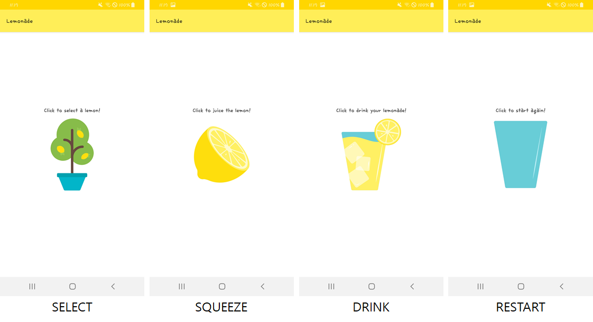
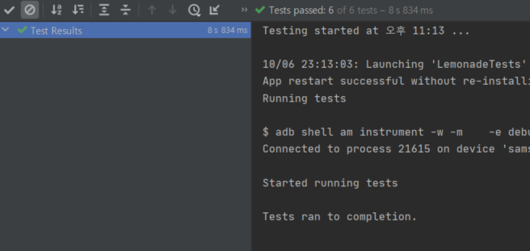

## Project: Lemonade App

[Google deveopler - Starter Code](https://github.com/google-developer-training/android-basics-kotlin-lemonade-app)

👆 이 링크에서 프로젝트의 기본 틀을 클론할 수 있다. 클론 후 주어진 조건에 따라 코드를 완성해보자.



**Lemonade 앱 개요**

4가지 state가 있다. 처음 앱은 SELECT 상태로 시작된다.

SELECT 상태에서 이미지를 클릭하면, SQUEEZE 화면으로 바뀌고, squeezeCount가 0으로 초기화되고, lemonSize가 2~4 사이 랜덤 숫자로 지정된다.

SQUEEZE 상태에서 이미지를 클릭하면, 클릭할 때 마다. squeezeCount는 +1, lemonSize는 -1이 되어, lemonSize가 0이 되는 순간 DRINK 상태로 전환한다.

DRINK 상태에서 이미지를 클릭하면 RESTART 상태로 전환하고, lemonSize=-1이 된다.

RESTART 상태에서 이미지를 클릭하면 SELECT로 돌아간다.

<br>

```kotlin
lemonImage!!.setOnClickListener {
		// TODO: call the method that handles the state when the image is clicked
		clickLemonImage()
}
```

중앙의 이미지를 클릭할 때마다 `setOnClickListener` 가 실행된다. 여기서 `clickLemonImage()` 함수를 호출한다.

```kotlin
private fun clickLemonImage() {
        if(lemonadeState==SELECT){
            lemonadeState=SQUEEZE
            setViewElements()
            lemonSize = lemonTree.pick()
            squeezeCount=0
        }else if(lemonadeState==SQUEEZE){
            squeezeCount++
            lemonSize--
            if(lemonSize==0) {
                lemonadeState = DRINK
                setViewElements()
            }
        }else if(lemonadeState==DRINK){
            lemonadeState=RESTART
            setViewElements()
            lemonSize=-1
        }else if(lemonadeState==RESTART){
            lemonadeState=SELECT
            setViewElements()
        }
}
```

`clickLemonImage()` 함수에서는 문제에서 주어진 조건을 작성했다. SELECT만 보면, `lemonadeState=SQUEEZE` 로 상태를 SQUEEZE로 변경하고, `setViewElements()`를 호출해 이미지를 변경하고, `lemonSize`를 `pick()` 함수를 호출해 랜덤 수를 지정하고, `sqeezeCount`를 0으로 초기화한다.

`setViewElements()`는 다음과 같다.

```kotlin
private fun setViewElements() {
        // TextView 와 ImageView 를 findViewById로 찾기
        val textAction: TextView = findViewById(R.id.text_action)
        val imageAction: ImageView = findViewById(R.id.image_lemon_state)
        val newText = when (lemonadeState) {
            SELECT -> resources.getString(R.string.lemon_select)
            SQUEEZE -> resources.getString(R.string.lemon_squeeze)
            DRINK -> resources.getString(R.string.lemon_drink)
            else -> resources.getString(R.string.lemon_empty_glass)
        }
        // 화면의 텍스트 변경
        textAction.setText(newText)
        // newImageResource에 lemonadeState에 대응하는 이미지 리소스 담기
        val newImageResource = when (lemonadeState) {
            SELECT -> R.drawable.lemon_tree
            SQUEEZE -> R.drawable.lemon_squeeze
            DRINK -> R.drawable.lemon_drink
            else -> R.drawable.lemon_restart
        }
        // 화면의 이미지 변경
        imageAction.setImageResource(newImageResource)
}
val submitText = getResources().getString(R.string.submit_label)
```

강의에서 string.xml에 있는 resource에 이렇게 액세스 하라는데, 나는 안된다. 🤔

`resources.getString(R.string.lemon_select)` 대신 이렇게는 됨.

`getString(R.string.lemon_select)` 단순히 getString만 사용하는 것도 가능한 것 같다.

[문자열 리소스 참고](https://developer.android.com/guide/topics/resources/string-resource#kotlin)

<br>

✏ **테스트 코드 돌리기**

강의에서 기본적으로 제공하는 테스트 코드가 있다.

전체 코드를 run 하면 어플이 우다다다 실행했다 꺼졌다한다. 😲

실행이 완료되면 초록 체크 표시를 확인할 수 있다.




**MainActivity.kt 전체 코드**

```kotlin
package com.example.lemonade

import androidx.appcompat.app.AppCompatActivity
import android.os.Bundle
import android.widget.ImageView
import android.widget.TextView
import com.google.android.material.snackbar.Snackbar

class MainActivity : AppCompatActivity() {

    private val LEMONADE_STATE = "LEMONADE_STATE"
    private val LEMON_SIZE = "LEMON_SIZE"
    private val SQUEEZE_COUNT = "SQUEEZE_COUNT"

    // SELECT represents the "pick lemon" state
    private val SELECT = "select"

    // SQUEEZE represents the "squeeze lemon" state
    private val SQUEEZE = "squeeze"

    // DRINK represents the "drink lemonade" state
    private val DRINK = "drink"

    // RESTART represents the state where the lemonade has be drunk and the glass is empty
    private val RESTART = "restart"

    // Default the state to select
    private var lemonadeState = "select"

    // Default lemonSize to -1
    private var lemonSize = -1

    // Default the squeezeCount to -1
    private var squeezeCount = -1

    private var lemonTree = LemonTree()
    private var lemonImage: ImageView? = null

    override fun onCreate(savedInstanceState: Bundle?) {
        super.onCreate(savedInstanceState)
        setContentView(R.layout.activity_main)

        // === DO NOT ALTER THE CODE IN THE FOLLOWING IF STATEMENT ===
        if (savedInstanceState != null) {
            lemonadeState = savedInstanceState.getString(LEMONADE_STATE, "select")
            lemonSize = savedInstanceState.getInt(LEMON_SIZE, -1)
            squeezeCount = savedInstanceState.getInt(SQUEEZE_COUNT, -1)
        }
        // === END IF STATEMENT ===

        lemonImage = findViewById(R.id.image_lemon_state)
        setViewElements()
        lemonImage!!.setOnClickListener {
            // TODO: call the method that handles the state when the image is clicked
            clickLemonImage()
        }
        lemonImage!!.setOnLongClickListener {
            // TODO: replace 'false' with a call to the function that shows the squeeze count
            showSnackbar()
        }
    }

    /**
     * === DO NOT ALTER THIS METHOD ===
     *
     * This method saves the state of the app if it is put in the background.
     */
    override fun onSaveInstanceState(outState: Bundle) {
        outState.putString(LEMONADE_STATE, lemonadeState)
        outState.putInt(LEMON_SIZE, lemonSize)
        outState.putInt(SQUEEZE_COUNT, squeezeCount)
        super.onSaveInstanceState(outState)
    }

    private fun clickLemonImage() {
        if (lemonadeState == SELECT) {
            lemonadeState = SQUEEZE
            setViewElements()
            lemonSize = lemonTree.pick()
            squeezeCount = 0
        } else if (lemonadeState == SQUEEZE) {
            squeezeCount++
            lemonSize--
            if (lemonSize == 0) {
                lemonadeState = DRINK
                setViewElements()
            }
        } else if (lemonadeState == DRINK) {
            lemonadeState = RESTART
            setViewElements()
            lemonSize = -1
        } else if (lemonadeState == RESTART) {
            lemonadeState = SELECT
            setViewElements()
        }
    }

    private fun setViewElements() {
        // TextView 와 ImageView 를 findViewById로 찾기
        val textAction: TextView = findViewById(R.id.text_action)
        val imageAction: ImageView = findViewById(R.id.image_lemon_state)

        // newText 에 lemonadeState에 대응하는 문자열을 담기
        val newText = when (lemonadeState) {
            SELECT -> getString(R.string.lemon_select)
            SQUEEZE -> resources.getString(R.string.lemon_squeeze)
            DRINK -> resources.getString(R.string.lemon_drink)
            else -> resources.getString(R.string.lemon_empty_glass)
        }
        // 화면의 텍스트 변경
        textAction.setText(newText)
        // newImageResource에 lemonadeState에 대응하는 이미지 리소스 담기
        val newImageResource = when (lemonadeState) {
            SELECT -> R.drawable.lemon_tree
            SQUEEZE -> R.drawable.lemon_squeeze
            DRINK -> R.drawable.lemon_drink
            else -> R.drawable.lemon_restart
        }
        // 화면의 이미지 변경
        imageAction.setImageResource(newImageResource)
    }

    private fun showSnackbar(): Boolean {
        if (lemonadeState != SQUEEZE) {
            return false
        }
        val squeezeText = getString(R.string.squeeze_count, squeezeCount)
        Snackbar.make(
            findViewById(R.id.constraint_Layout),
            squeezeText,
            Snackbar.LENGTH_SHORT
        ).show()
        return true
    }
}

class LemonTree {
    fun pick(): Int {
        return (2..4).random()
    }
}
```