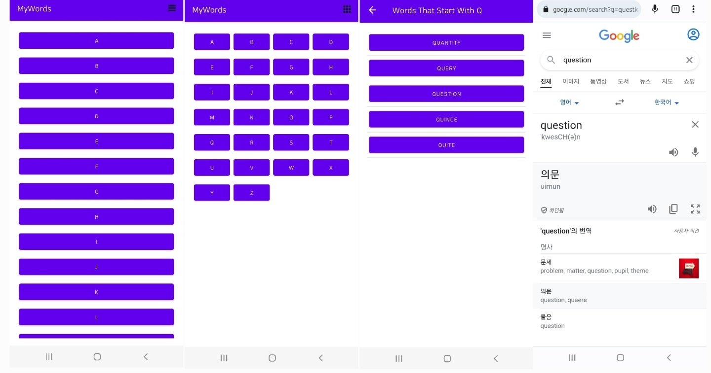

## [Unit3 pathway 1] 

#### 구체적인 학습 내용 정리
- [Navigation 2](https://velog.io/@emily2307/Unit-3-Navigation-2)
- [Navigation 3](https://velog.io/@emily2307/Unit3-Navigation-3)
- [Navigation 4](https://velog.io/@emily2307/Unit-3-Navigation-4)

**키워드**: Implicit intent, Explicit intent, LayoutManager, Fragment, Fragment LifeCycle / Navigation / NavGraph

**Words app 개요**

- 시작화면에서는 알파벳 목록을 보여준다.
- 알파벳을 클릭하면 해당 알파벳으로 시작하는 단어 목록을 보여준다.
- 단어를 클릭하면 구글에 해당 단어를 검색한 창으로 연결된다.
- 알파벳 목록은 linear layout과 grid layout 두가지로 보여준다. (오른쪽 상단 아이콘을 누르면 layout이 바뀐다)

