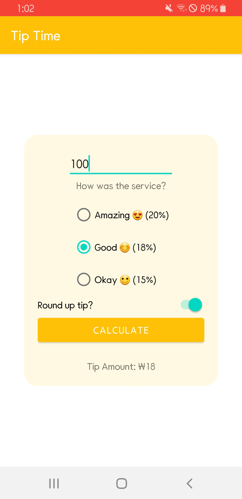

## [Unit1 pathway 3] Build a basic layout

#### 👉 [구체적인 학습 내용 정리](https://velog.io/@emily2307/Unit-2-Layouts-1) 👈 

사용자가 입력한 금액과 선택한 서비스 평가에 따라 팁을 계산해 알려주는 어플 사용자가 사용하는 통화 단위에 따라 표기되며 아무것도 입력하지 않은 경우 null값을 처리한다.

#### 최종 화면